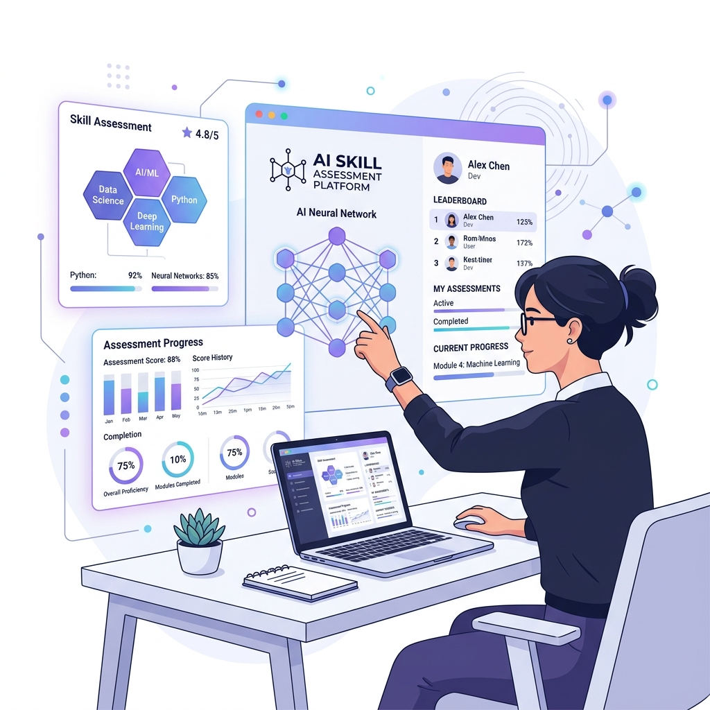
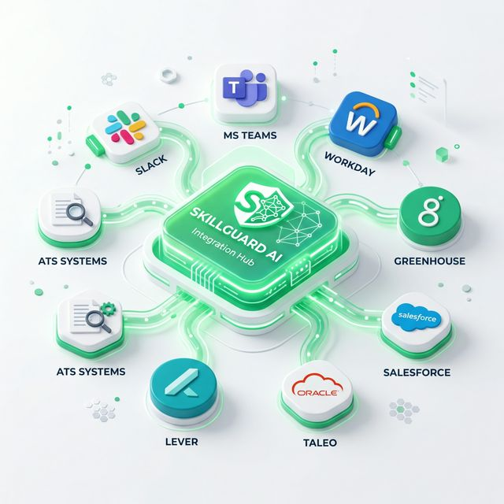
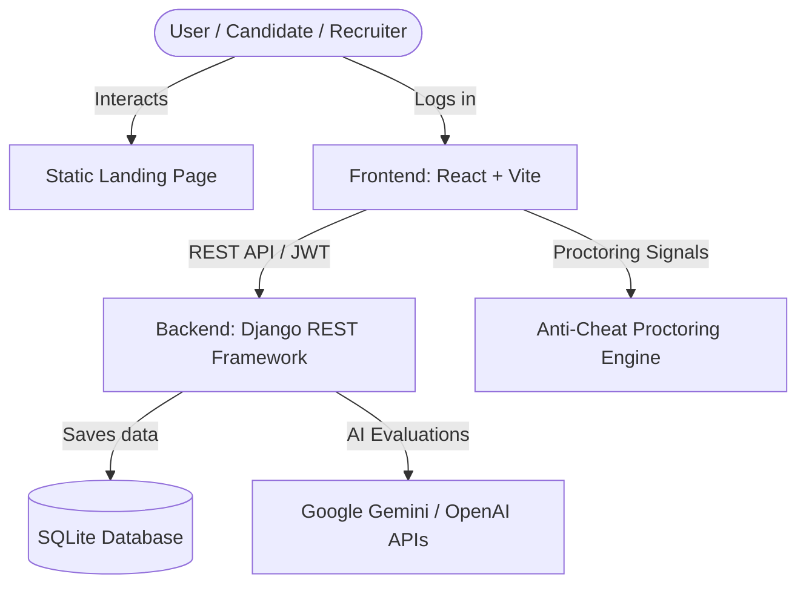

# SkillGuard AI – AI-Based Skill Assessment & Recruitment System

<p align="center">
  
</p>

---

## 🌟 Introduction

**SkillGuard AI** is a cutting-edge, intelligent SaaS platform designed to revolutionize the recruitment funnel through automated, objective, and anti-cheat skill validation. By leveraging advanced Artificial Intelligence models (Gemini API & OpenAI), the platform provides an automated screening experience for HR/Recruiters and a gamified, insightful benchmarking playground for Candidates/Students.

### 💡 The Problem & Our Solution
* **Recruiter Burnout:** HR departments spend hours screening resumes manually. SkillGuard AI automates this using semantic resume parsing and instant AI-led technical screening.
* **Unconscious Bias:** Traditional hiring processes can introduce bias. SkillGuard AI relies strictly on performance metrics and standardized AI evaluation.
* **Lack of Feedback:** Traditional portals leave applicants guessing. SkillGuard AI provides detailed, constructive domain-specific feedback and personalized learning roadmaps.

---

## 📸 Platform Highlights

<table style="width: 100%; border-collapse: collapse;">
  <tr>
    <th style="text-align: center; width: 50%;">🤖 AI-Powered Interviewer</th>
    <th style="text-align: center; width: 50%;">⚙️ Dynamic Workflows</th>
  </tr>
  <tr>
    <td></td>
    <td></td>
  </tr>
  <tr>
    <th style="text-align: center; width: 50%;">📊 Recruiter Dashboard</th>
    <th style="text-align: center; width: 50%;">✍️ Secure Proctoring & Testing</th>
  </tr>
  <tr>
    <td></td>
    <td></td>
  </tr>
</table>

---

## ✨ Key Features

### 👨‍🎓 1. Candidate / Student Portal
* **AI-Driven Skill Assessments:** Interactive coding and technical evaluations tailored by role.
* **Interactive AI Interviewer:** Dynamic conversational interviews that react to candidates' spoken or typed responses in real-time.
* **Resume/CV Analyzer:** Upload your resume to get instant match scores, profile analysis, and custom-tailored practice questions.
* **Confidence & Soft Skills Checker:** Evaluates tone, speech clarity, vocabulary coherence, and overall communication confidence.
* **Personalized AI Career Roadmaps:** A 3-tiered (Beginner, Intermediate, Advanced) visual progression path generated dynamically to bridge detected skill gaps.

### 👩‍💼 2. Recruiter Portal
* **Automated Assessment Builder:** Quickly construct custom coding tests, MCQs, or behavioral questionnaires.
* **ATS & Candidate Analytics:** Deep-dive reports with resume parsed scores, grading criteria, and cheat flags.
* **Candidate Comparison Matrix:** Compare candidate metrics side-by-side to make data-backed final hiring decisions.
* **Anti-Cheat Proctoring Engine:** Detects window resizing, tab switching, and screen sharing, automatically flagging anomalies and auto-submitting exams on repeated violations.

---

## 🛠️ Architecture & Tech Stack



* **Frontend:** React.js, Vite, Framer Motion (micro-animations), Lucide React (icons), Native CSS
* **Backend:** Django, Django REST Framework (DRF), SimpleJWT (Token Auth)
* **Database:** SQLite (default/local) / PostgreSQL (production-ready)
* **AI/LLM Integration:** Google Generative AI (Gemini SDK), OpenAI SDK, PyPDF2 & docx-python (Resume Parsers)

---

## 🚀 Setup & Installation

Follow these steps to spin up the local development environment.

### 🔑 1. Environment Variable Setup
Create a `.env` file inside the `backend/` directory and configure the following variables:
```env
DEBUG=True
SECRET_KEY=your-django-secret-key
GEMINI_API_KEY=your-gemini-api-key
OPENAI_API_KEY=your-openai-api-key
```

Create a `.env` file inside the `frontend/` directory:
```env
VITE_API_URL=http://localhost:8000/api
```

---

### 🐍 2. Backend Setup (Django)

1. **Navigate to the backend folder:**
   ```bash
   cd backend
   ```
2. **Create and activate a virtual environment:**
   * **Windows (PowerShell):**
     ```powershell
     python -m venv venv
     .\venv\Scripts\Activate.ps1
     ```
   * **macOS/Linux:**
     ```bash
     python3 -m venv venv
     source venv/bin/activate
     ```
3. **Install dependencies:**
   ```bash
   pip install -r requirements.txt
   ```
4. **Run migrations:**
   ```bash
   python manage.py migrate
   ```
5. **Seed the database (Initial assessments and sample data):**
   ```bash
   python manage.py seed_assessments
   ```
6. **Start the development server:**
   ```bash
   python manage.py runserver
   ```
   *The backend will be running at `http://localhost:8000/`*

---

### ⚛️ 3. Frontend Setup (React + Vite)

1. **Navigate to the frontend folder:**
   ```bash
   cd ../frontend
   ```
2. **Install node dependencies:**
   ```bash
   npm install
   ```
3. **Start the Vite development server:**
   ```bash
   npm run dev
   ```
   *The frontend application will be running at `http://localhost:5173/`*

---

### 🌐 4. Landing Page Setup
The static landing page is available under the `landing/` directory. You can open `landing/index.html` directly in your browser or serve it using any simple HTTP server (e.g., Live Server in VS Code).

---

## 📂 Repository Structure

```text
├── backend/                  # Django REST API backend
│   ├── api/                  # API endpoints, views, serializers, models
│   ├── core/                 # Django core project configuration
│   ├── seed_assessments.py   # Seeding script for mock data
│   └── requirements.txt      # Python dependencies
├── frontend/                 # React Vite frontend
│   ├── src/                  # Components, contexts, pages, styles
│   ├── public/               # Public assets and illustrations
│   ├── index.html            # Vite entry point
│   └── package.json          # Node modules/scripts
├── landing/                  # Static landing page (HTML/CSS/JS)
│   ├── index.html            # Core landing page
│   ├── styles.css            # Landing page CSS
│   └── script.js             # Interactive scroll & logic animations
├── README.md                 # Main workspace documentation
└── .gitignore                # Global git ignore configurations
```

---

## 🔮 Future Roadmap
* **Video Analytics & Emotion AI:** Analyze facial expressions and body language in real-time during speaking assessments to gauge stress/confidence.
* **Live Sandbox Compilers:** Integrated code editors with online runtime execution for technical assessments.
* **External ATS Syncing:** Directly push/pull candidate details into platforms like LinkedIn Talent Hub or Workday.
